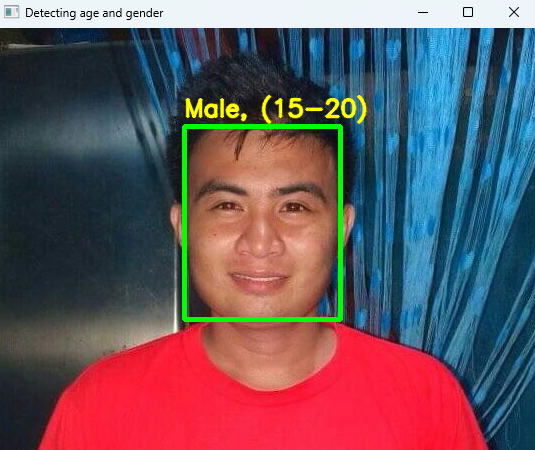

# Gender and Age Detection OpenCV Python

This project implements gender and age detection using Python and OpenCV. With deep learning techniques, the project can accurately identify the gender and approximate age of a person from a single image of their face.

### Overview

OpenCV, short for Open Source Computer Vision, is an open-source library that supports real-time image and video processing, as well as analytical capabilities. This project leverages Python OpenCV along with deep learning frameworks like TensorFlow, Caffe, and PyTorch.

### Problem Statement

The objective of this project is to build a gender and age detector that can predict the gender and age range of a person's face in a picture. The predicted gender can be either 'Male' or 'Female', while the predicted age falls into predefined ranges such as (0 – 2), (4 – 6), (8 – 12), etc.

Recognizing an exact age from a single image is challenging due to various factors like makeup, lighting, and facial expressions. Hence, the project treats age detection as a classification problem rather than regression.

# Project Structure

The project directory includes the following files:

- age_deploy.prototxt: Age detection model architecture file.
- age_net.caffemodel: Pre-trained age detection model weights.
- gender_deploy.prototxt: Gender detection model architecture file.
- gender_net.caffemodel: Pre-trained gender detection model weights.
- jude.jpg: Sample image for testing the gender and age detection.
- main.py: Python script for detecting gender and age from an image.
- opencv_facedetector_unit8.pb: OpenCV face detector model file.
- opencv_face_detector.pbtxt: OpenCV face detector model configuration file.
- requirements.txt: List of dependencies for the project.

### Usage

To run the gender and age detection on an image, use the main.py script. Make sure you have all the required dependencies installed, which are listed in requirements.txt.

python main.py --image your_image.jpg

Replace your_image.jpg with the path to the image you want to analyze.

### Acknowledgments

This project utilizes the Adience dataset for training and testing the gender and age detection models. We acknowledge the developers and contributors of OpenCV, Caffe, and other related libraries for their valuable contributions to the field of computer vision and deep learning.
